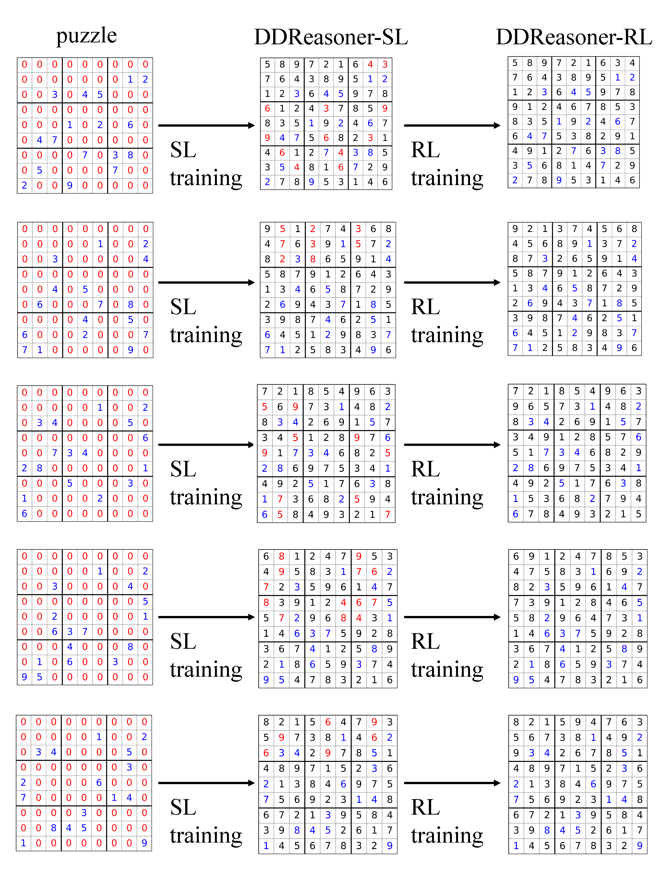

# DDReasoner: Denoising Diffusion Models for Symbolic Reasoning

Official codebase for the paper:  **Constraints-Guided Diffusion Reasoner for Neuro-Symbolic Learning**

---

## 🧠 Overview

We introduce DDReasoner, a diffusion model as a reasoner for neuro-symbolic learning, and adopt a two-stage training pipeline. In our work, we introduce a novel application of reinforcement learning (RL) to internalize logical rules and specific constraints into DDReasoner’s capabilities while training. Our RL algorithm reframes the denoising process as a Markov Decision Process (MDP) and applies **policy optimization** using constraints-based reward signals.


## 📦 Environment Setup

```bash
conda create -n ddr python=3.11.9
conda activate ddr
pip install -r requirements.txt
```


## 🚀 SL & RL Training

### 🔧 SL training

#### Scripts for different tasks

```bash
python sl.py --task sudoku --dataset big_kaggle # for Sudoku
python sl.py --task maze --size 10 --train_ratio 0.9 --valid_ratio 0.0 # for Maze
python sl.py --task grid --train_ratio 0.6 --valid_ratio 0.2 --test_ratio 0.2 # for Simple Path Prediction
python sl.py --task sushi --train_ratio 0.6 --valid_ratio 0.2 --test_ratio 0.2 # for Preference Learning
python sl.py --task warcraft --train_ratio 1.0 --size 30 # for minimum-cost path finding
```

#### 🔧 RL training

```bash
python rl.py --task sudoku --dataset big_kaggle --train_ratio 0.9 --valid_ratio 0.0 # for Sudoku
python rl.py --task maze --size 10 --train_ratio 0.9 --valid_ratio 0.0 # for Maze
python rl.py --task grid --train_ratio 0.6 --valid_ratio 0.2 --test_ratio 0.2 # for Simple Path Prediction
python rl.py --task sushi --train_ratio 0.6 --valid_ratio 0.2 --test_ratio 0.2 # for Preference Learning
python rl.py --task warcraft --train_ratio 1.0 --size 30 # for minimum-cost path finding
```


## 📊 Evaluation
### Run analysis on a trained model:

```bash
python test.py --task sudoku --dataset big_kaggle --train_ratio 0.9 --valid_ratio 0.0 # an example for Sudoku
```

### Visualize

```bash
python ./visualize/visualize_sudoku.py.py # for Sudoku
python ./visualize/visualize_maze.py.py # for Maze
```


## ✏️ Examples

We provide some examples where problems, initially unsolved by SL training, are successfully addressed by our RL approach.

### Sudoku



### Maze


